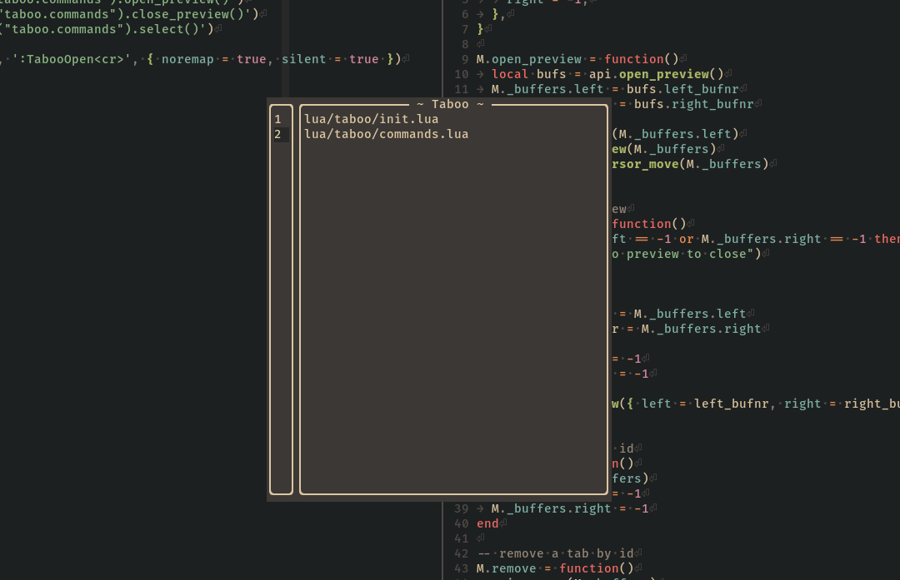

<div align="center">

# Taboo
#### Handy tab GUI.

[](http://www.lua.org)
[](https://neovim.io)



</div>

## Installation

### Using Plug

```vim
Plug 'JavierPoduje/taboo'
```

Then run :PlugInstall to install the plugin.

### Using Packer

```vim
require('packer').startup(function(use)
  use 'javierpoduje/taboo'
end)
```

Then run :PackerInstall to install the plugin.

## Configuration

In your Neovim configuration add the following:

```vim
require("taboo")
vim.api.nvim_set_keymap("n", "<leader>tt", ":TabooOpen<CR>", { noremap = true, silent = true })
```

## Contributing

Contributions to taboo are welcome! If you have an idea for a feature or a bug fix, feel free to open an issue or submit a pull request.
